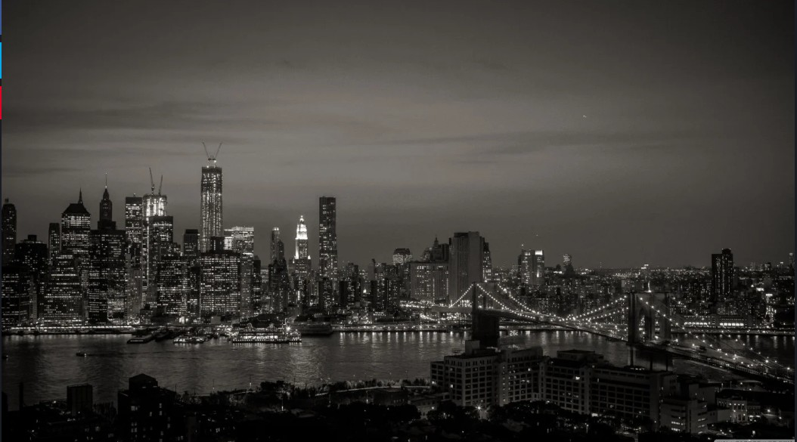

# Md Sourav Oyaj - Personal Portfolio (Nihal Morshed Style)

A premium, interactive, and modern portfolio website featuring a dark/neon aesthetic, built with high-performance animations and responsive architecture.

## 🚀 Live Demo
Check out the live site here: [https://mr-captrox.github.io/portfolio2/](https://mr-captrox.github.io/portfolio2/)

## ✨ Key Enhancements
- **Aesthetic**: Premium Neon/Dark theme (`#0b111e` with `#ff0055` accents) inspired by the Nihal Morshed reference.
- **Navigation**: Fixed vertical sidebar with integrated active link tracking and mobile-responsive toggle.
- **Interactive Elements**:
    - **Typed.js**: Multi-role cycling effect in the hero section.
    - **AOS (Animate On Scroll)**: Smooth entrance animations for all sections.
    - **Neon Borders**: Interactive glowing hover effects on project and skill cards.
- **New Sections**:
    - **Education**: Detailed B.Sc. in CSE timeline from IIUC.
    - **Certifications**: Professional 80-hour Mobile App Development training (EDGE Project).
    - **Competitive Programming (CP)**: Dedicated cards for Codeforces, LeetCode, etc.
- **Enhanced Projects**: Featured "AI Chatbot - Groq Llama 3 Edition" with full tech summary.

## 🛠️ Built With
- **Styling**: Tailwind CSS (Utility-first framework)
- **Iconography**: Boxicons (Professional tech icons)
- **Animations**: [AOS](https://michalsnik.github.io/aos/) (Scroll interactions) & [Typed.js](https://mattboldt.github.io/typed.js/) (Hero text)
- **Backend Logic**: Formspree (Form integration)
- **Core**: Vanilla JavaScript (Interactive logic)

## 📁 Repository Overview
- `index.html`: Main application and layout file.
- `images/`: High-resolution graphics and project screenshots.
- `README.md`: Documentation (you are here).

## 👨‍💻 About Me
I am a B.Sc. in Computer Science and Engineering student at **International Islamic University Chittagong (IIUC)** and a passionate Web & App developer. I specialize in building scalable web solutions with a focus on AI/ML and modern UI/UX design.

---
© 2025 Md Sourav Oyaj. Built with ❤️ and Code.
